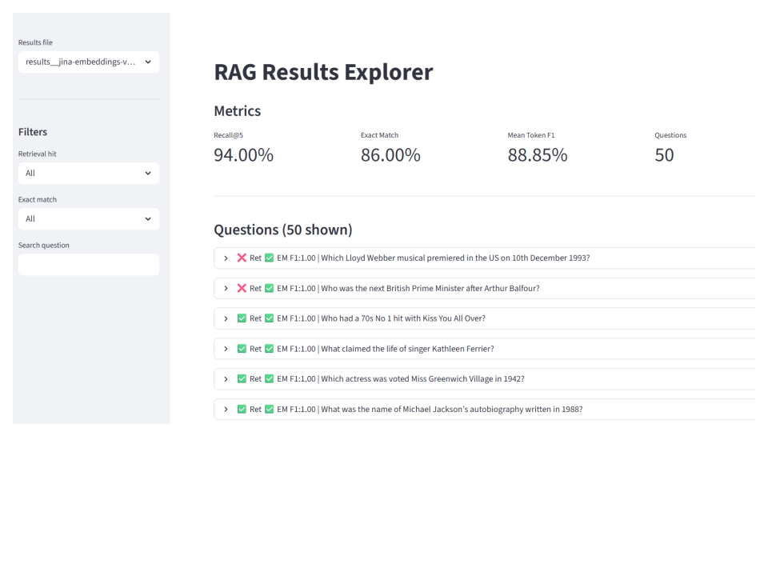

# RAG Pipeline for Question Answering

A Retrieval-Augmented Generation (RAG) pipeline evaluated on the TriviaQA `rc.wikipedia` dataset. The system retrieves relevant Wikipedia passages using a vector store and generates short factual answers with an LLM.

---

## Results

| Embedding Model | Chunk Size | Overlap | Top-k | Context Passages | LLM | Recall@5 | Exact Match | Token F1 |
|---|---|---|---|---|---|---|---|---|
| `text-embedding-3-small` (OpenAI) | 512 | 64 | 5 | 3 | `gpt-4.1` | 0.88 | — | — |
| `jina-embeddings-v5-text-nano` (local) | 512 | 64 | 5 | 3 | `gpt-5.4-nano` | 0.94 | 0.76 | 0.81 |
| `jina-embeddings-v5-text-nano` (local) | 512 | 64 | 5 | 3 | `gpt-4.1` | **0.94** | **0.86** | **0.89** |

---

## Project Structure

```
rag project/
├── pipeline.py          # Main entry point — runs full RAG evaluation
├── config.py            # All settings (model, retrieval, dataset, paths)
├── app.py               # Streamlit results browser
├── requirements.txt     # Python dependencies
├── report.md            # Full evaluation report
├── src/
│   ├── data_loader.py   # Load TriviaQA questions and Wikipedia passages
│   ├── embeddings.py    # Jina v5 nano embedding wrapper (asymmetric)
│   ├── indexer.py       # Build/load ChromaDB vector index
│   ├── retriever.py     # Retrieve top-k chunks and compute Recall@k
│   ├── generator.py     # Generate answers via OpenAI API or local LLM
│   └── evaluator.py     # Compute EM, Token F1; save results to CSV/JSON
├── chroma_db/           # Persistent ChromaDB vector store (auto-created)
└── results/             # Per-run CSV and JSON metrics (auto-created)
```

---

## Setup

**Requirements:** Python 3.10

```bash
pip install -r requirements.txt
```

Set your OpenAI API key in `config.py`:

```python
OPENAI_API_KEY = "sk-..."
OPENAI_MODEL   = "gpt-4.1"
LLM_BACKEND    = "openai"
```

---

## Running the Pipeline

**First run** — builds the ChromaDB index and runs evaluation:

```bash
python pipeline.py
```

**Force rebuild** the index (use after changing embedding model or chunk settings):

```bash
python pipeline.py --rebuild
```

---

## Configuration

All settings are in `config.py`:

| Setting | Default | Description |
|---|---|---|
| `EMBEDDING_MODEL` | `jinaai/jina-embeddings-v5-text-nano` | HuggingFace embedding model |
| `LLM_BACKEND` | `openai` | `"openai"` or `"local"` |
| `OPENAI_MODEL` | `gpt-4.1` | OpenAI model name |
| `CHUNK_SIZE` | 512 | Characters per chunk |
| `CHUNK_OVERLAP` | 64 | Overlap between chunks |
| `TOP_K` | 5 | Passages retrieved per question |
| `MAX_CONTEXT_PASSAGES` | 3 | Passages passed to LLM |
| `NUM_QUESTIONS` | 50 | Questions to evaluate |

---

## Browsing Results

Launch the Streamlit app to interactively browse per-question predictions and retrieved chunks:

```bash
streamlit run app.py
```

Results are color-coded:
- **Green** — exact match correct
- **Yellow** — retrieval hit but wrong answer
- **Red** — retrieval miss

---

## Evaluation Metrics

| Metric | Description |
|---|---|
| **Recall@5** | Fraction of questions where the gold answer string appears in the top-5 retrieved chunks |
| **Exact Match (EM)** | Fraction of predictions that exactly match a gold answer after normalization |
| **Token F1** | Mean token-level overlap between predicted and gold answers |

---

## Demo


